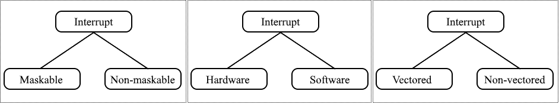

### INTRODUCTION 

Modern Operating Systems are interrupt-driven, that is, the processor executes the set of instructions in a program and keeps running the instructions until either they can't go any further or an interrupt signal is sensed. After the interrupt signal is sensed, the computer may need to suspend its current activities until the interrupt is served. The predecessor to interrupts in CPU was polling. <b>Polling</b> is the state of continuous monitoring. The microcontroller continuously checks the status of other devices; no other operation is performed during this process and all its processing time is consumed for monitoring. This problem can be addressed by using interrupts. The controller responds only when an interruption occurs in the interrupt method.

An <b>interrupt</b> is a signal by an external entity ( I/O hardware, Direct memory access (DMA), etc. ) which needs the CPU's imminent attention. For example, input from the keyboard or mouse. The controller completes the execution of the current instruction and starts the execution of an Interrupt Service Routine (ISR) or Interrupt Handler whenever an interrupt occurs. ISR instructs the processor or controller what to do when the interrupt occurs. Interrupts can be classified based on many parameters. Figure 1 represents the classification of interrupt based on parameters such as maskability, sources of interrupts, and ISR address.

#### Classification of Interrupts:

Fig 1 : Classification of interrupt based on maskability, sources of interrupts, and ISR address respectively
 

<li style="text-align:justify;"><b>Maskability :</b> Based on maskability, interrupts can be classified into two types that are maskable and non-maskable interrupts. <b>Maskable interrupts</b> can be disabled or ignored by the CPU and are relatively low priority interrupts. These interrupts can be disabled by applying some code by the programmer. <b>Non-Maskable interrupts</b> are those which can't be disabled by writing code. The processor has to handle it. These types of interrupts are highly prioritized.</li>
<li style="text-align:justify;"><b>Source of Interrupts :</b> Hardware and software interrupts are types of interrupts classified based on the source of an interrupt. <b>Hardware interrupts</b> are raised by hardware devices and are wired to the CPU and sends a signal directly to the dedicated CPU Interrupt pin. These are asynchronous and may occur at any time. <b>Software interrupts</b> are those that are generated by the user software for obtaining any required services of the Operating System. A software interrupts often occurs when an application software terminates or when it requests the operating system for some service.</li>
<li style="text-align:justify;"><b>ISR Address :</b> There are two types of interrupts here that are vectored or non-vectored Interrupts. In <b>vectored interrupts</b>, the CPU knows the address of Interrupt Service Routine. The interrupting device sends its unique vector via a data bus and through its I/O interface to the CPU. The CPU takes this vector, checks an interrupt table in memory, and then carries out the correct ISR for that device. So the vectored interrupt allows the CPU to be able to know what ISR to carry out in software (memory). In <b>non-vectored interrupts</b>, the address is provided by the program that is raising the interrupt. In this case, the interrupting device never sends an interrupt vector. The CPU receives an interrupt and jumps the program counter to a fixed address in hardware.</li>

#### Sequence of events involved in handling an interrupt :
<ol style="text-align:justify;">
<li>CPU clears the Interrupt line and raises the Interrupt Acknowledgement</li>         
<li>Using the pointer to the current Process Control Block, the state and all register values for the currently executing process are saved for the use when the process is restarted</li>
<li>The CPU mode bit is switched to Supervisory mode</li>
<li>Using the pointer to the interrupt handler table and the interrupt vector, the location of the kernel code to execute is determined</li>
<li>Processing is switched to the appropriate portion of the kernel</li>
<li>After Interrupt is executed, the Process Control Block of the</li> previously executing process is loaded into the memory and its execution is resumed</li>
</ol>

The interval of time between an interrupt request signal is generated and the source of the interrupt is serviced is known as <b>interrupt latency</b>. When multiple interrupt is generated, an interrupt request is processed in priority order.

