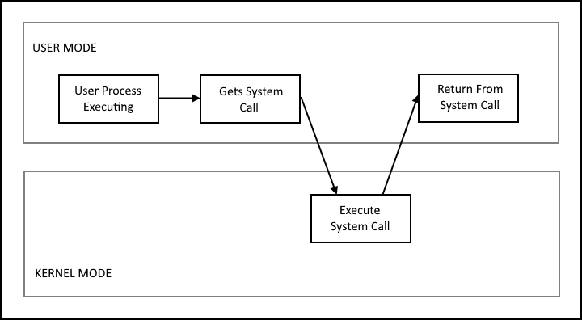
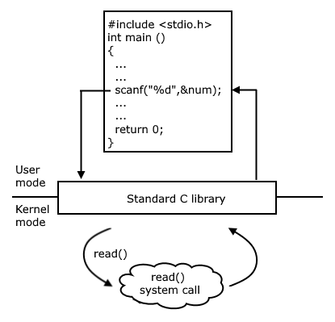

### INTRODUCTION 

A <b>system call</b> is a programmatic method in which a computer program requests a service from the kernel of the operating system. System calls allow the user program to ask the Operating System to perform the task reserved for it. The following example illustrates how system calls are used. Writing a program to copy the data from one file to another file. The program will need inputs such as names of the two files: the input file and the output file, and need to check the existence of the files. Each of these operations requires system calls: first one to prompt a message on the screen, to read the characters that define the two files from the keyboard and then once the file names are obtained another sequence of system calls to open the input file, to create the output file and to read and write the data from input file to output file.

Depending on the functionality provided by the underlying processor, there are a variety of ways to invoke system calls and all the methods are used by a process to request action by the operating system. The system calls are treated as the software interrupt by the hardware when it is executed. When a system call is invoked, the control passes through the interrupt vector to a service routine which is a part of the operating system. The interrupting instruction is examined by the kernel to determine the type of system call occurred and the kernel verifies the correctness of the system call and executes the request. Then the control is returned to the instruction following the system call. Figure 1 shows the execution of the system call. 

Figure 1. The execution of the system call
 

As shown in the above figure, the processes execute normally in the user mode until a system call interrupts it. Then on the priority basis, the system call is executed in the kernel mode. After the execution of the system call, the control returns to the user mode and execution of user processes continues.

#### Types of system calls:

System calls are categorized into six major types : process control, file management or file manipulation, device manipulation, information maintenance, communications and protection. Table 1 shows the examples of Windows and Unix system calls.

1. 
<b>Process control :</b> This type of system calls deals with the processes such as process creation, process termination, etc. The process in the system needs to be created, aborted or deleted. There are many operations available to manage a process. Such as : 
fork() : used to create a process 
exit(): used to terminate a process 
wait(): used to block the calling process until one of its child processes exits or a signal is received.

2. 
<b>File management :</b> These system calls handle file manipulation operations such as creating a file, reading a file, writing into a file, etc. We need to open a file once it is created to use it. Finally, we need to close the file, indicating that we are no longer using it. Some operations used for file management system calls are as follows :  
open(): used to open a file 
read(): used to read the data from a file 
write(): used to write file.

3. 
<b>Device manipulation :</b> Device manipulation type of system calls are responsible for handling device related tasks such as reading from device buffers, writing into device buffers etc. A process may need several resources to execute, like main memory, disk drives, access to files etc. The resources can be granted only if the resources are available, otherwise the process will have to wait until sufficient resources are available. 
ioctl(): this function is used for controlling device-specific input/output operations.

4. 
<b>Information maintenance :</b> These system calls are responsible for transferring information between the user program and the operating system. For example: current time and date. 
getpid(): returns the process ID of the current process 
sleep(): places the process in an inactive state for a period of time.

5. 
<b>Communications :</b> Communication related system calls are used for interprocess communications. These can be used for communicating between the process either on the same machine or between processes on different nodes of a network. Message-passing model and shared memory model are two models of inter process communication. In the <b>message-passing model</b>, a common mailbox is used for communication between the process. In the <b>shared memory model</b>, processes  use shared memory create and shared memory attach system calls to create and gain access to regions of memory owned by other processes. 
pipe(): used to pass information from one process to another.

6. 
<b>Protection :</b> Protection system calls are the mechanisms for controlling access to the resources provided by a computer system. Set permission, get permission,  allow user and deny user system calls are the examples of this type of system calls. Set permission and get permission manipulate the permission settings of resources such as files and disks, and allow user and deny user system calls are used to specify whether particular users can or cannot be allowed access to certain resources. 
chmod(): used to change permissions of a file 
umask(): sets the process's file mode creation mask

<table id="table">
<tr>
  <th style="text-align:center;  padding: 5px;">Types</th>
  <th style="text-align:center; padding: 5px;" colspan="2">Windows</th>
  <th style="text-align:center; padding: 5px 50px 5px 50px;">Unix</th>
</tr>

 <tr><td style="text-align:center;  padding: 5px;">Process Control</td>
  <td style="text-align:center; padding: 5px;" colspan="2">CreateProcess()  ExitProcess()  WaitForSingleObject()</td>
  <td style="text-align:center; padding: 5px 50px 5px 50px;">fork()  exit()  wait()</td>
</tr>
<tr>
  <td style="text-align:center; padding: 5px;">File Management</td>
  <td style="text-align:center;  padding: 5px;" colspan="2">CreateFile()  ReadFile()  WriteFile()  CloseHandle()</td>
  <td style="text-align:center; padding: 5px 50px 5px 50px;">open()  read()  write()  close()</td>
</tr>
<tr>
  <td style="text-align:center; padding: 5px;">Device Management</td>
  <td style="text-align:center;  padding: 5px;" colspan="2">SetConsoleMode()  ReadConsole()  WriteConsole()</td>
  <td style="text-align:center; padding: 5px 50px 5px 50px;">ioctl()  read()  write()</td>
</tr>
<tr>
  <td style="text-align:center; padding: 5px;">Information Maintenance</td>
  <td style="text-align:center;  padding: 5px;" colspan="2">CreateFile()  ReadFile()  WriteFile()  CloseHandle()</td>
  <td style="text-align:center; padding: 5px 50px 5px 50px;">open()  read()  write()  close()</td>
</tr>
<tr>
  <td style="text-align:center; padding: 5px;">Communication</td>
  <td style="text-align:center;  padding: 5px;" colspan="2">CreatePipe() 
CreateFileMapping()  MapViewOfFile()</td>
  <td style="text-align:center; padding: 5px 50px 5px 50px;">pipe()  shmget()  mmap()</td>
</tr>
<tr>
  <td style="text-align:center; padding: 5px;">Protection</td>
  <td style="text-align:center;  padding: 5px;" colspan="2">SetFileSecurity()  InitlializeSecurityDescriptor()  SetSecurityDescriptorGroup() </td>
  <td style="text-align:center; padding: 5px 50px 5px 50px;">chmod()  umask()  chown()</td>
</tr>
</table>

Table 1: Examples of system call in WIndows and linux

#### Example of standard C library :

For many versions of UNIX and Linux operating systems, the standard C library provides a portion of the system-call interface. For Example, let's assume a C program invokes the scanf () statement. The C library intercepts this call and invokes the necessary system call(s) in the operating system - in this instance, the read() system call. The read() returns the value entered by the user on success. This is shown in Figure 2.

Figure 2: Standard C library handling of read()
 

System calls are mostly accessed by programs via a high-level Application Program Interface (API) rather than direct system call use. Three most common APIs are Win32 API for Windows, POSIX API for POSIX-based systems (Linux, Mac OS X, etc), and Java API for the Java virtual machine (JVM).

